### Examen Unidad 2:

---

### - TEST 1: Interacción rotativa (Registro,Login y Recuperación):
##### Objetivo:
Validar que el usuario pueda navegar correctamente entre los módulos de registro, inicio de sesión y recuperación de contraseña sin errores, manteniendo la coherencia en la interfaz y funcionalidad del sistema.

##### Resultado esperado:
El usuario logra acceder y alternar entre las opciones de registro, login y recuperación de contraseña de manera fluida, sin fallos de navegación ni errores en la interfaz.

#### Registro:
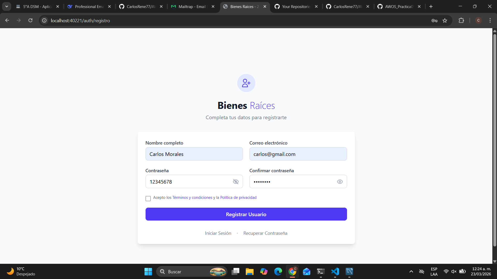

#### Login:
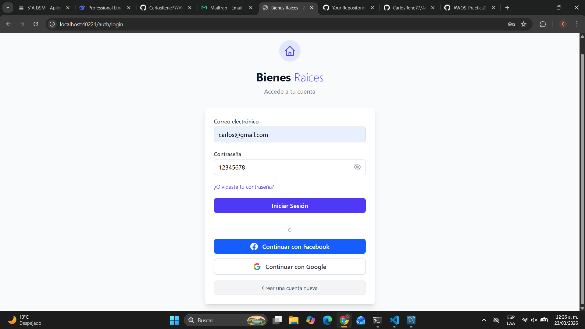

#### Recuperación:
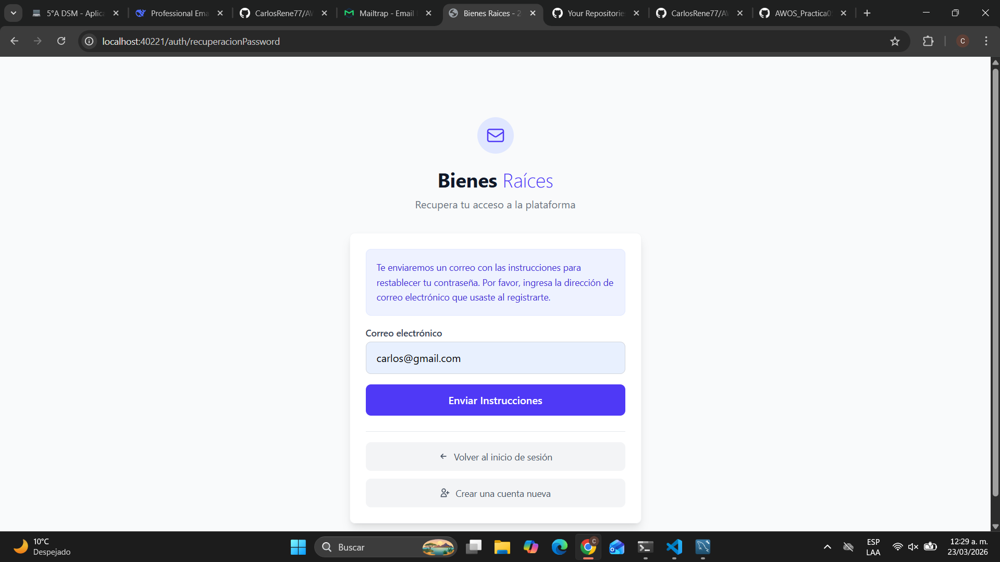

---

### - TEST 2: Registro exitoso de un nuevo usuario:
##### Objetivo:
Verificar que el sistema permita registrar correctamente a un usuario nuevo cuando todos los datos ingresados son válidos.

##### Resultado esperado:
El usuario es registrado exitosamente en la base de datos y recibe confirmación (visual y/o por correo electrónico).
#### Mensaje de exito:
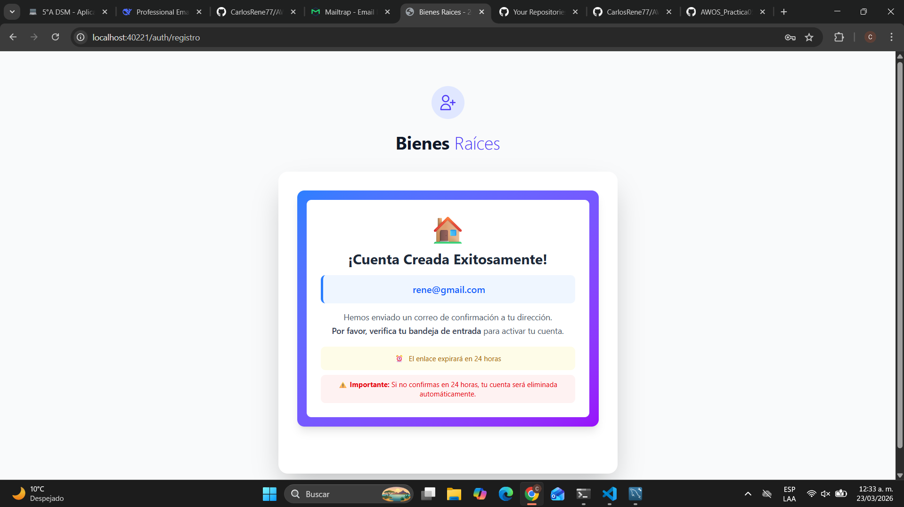

#### Nuevo Usuario en Base de datos:
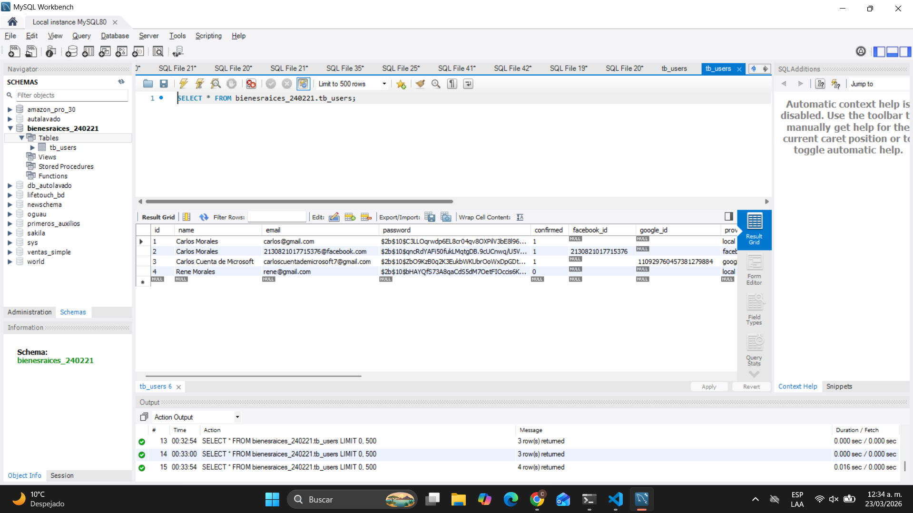

---

### - TEST 3: Registro Fallido de un Nuevo Usuario por Formulario mal llenado
##### Objetivo:
Validar que el sistema detecte errores en los campos del formulario de registro cuando los datos no cumplen con las validaciones establecidas.

##### Resultado esperado:
El sistema muestra mensajes de error claros y dinámicos, impidiendo el registro hasta que los datos sean corregidos.

#### Usuario Fallido:
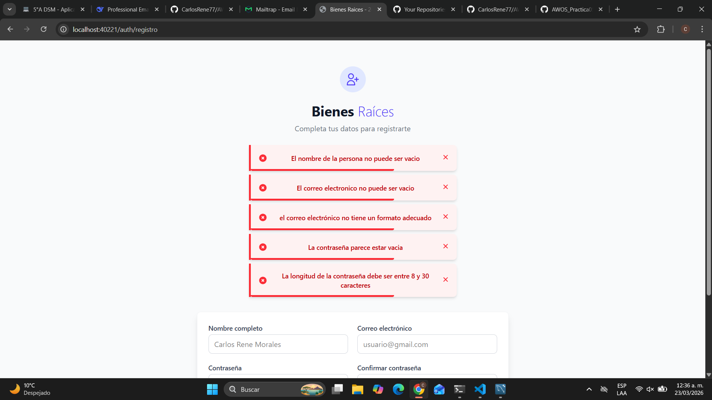

---

### - TEST 4: Registro Fallido por correo duplicado
##### Objetivo:
Comprobar que el sistema no permita registrar usuarios con un correo electrónico previamente registrado.

##### Resultado esperado:
El sistema detecta el correo duplicado y muestra un mensaje de error adecuado sin crear una nueva cuenta.

#### Correo Duplicado:
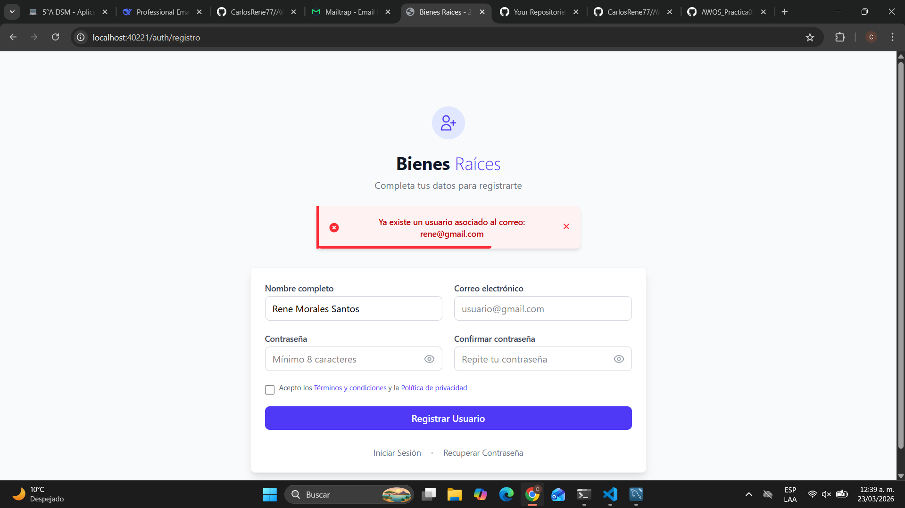

---

### - TEST 5: Validación de Usuario por Email
##### Objetivo:
Verificar que el usuario pueda validar su cuenta mediante un enlace enviado a su correo electrónico.

##### Resultado esperado:
El usuario valida su cuenta exitosamente y el sistema actualiza su estado a “verificado”.

#### Validación enviada al email:
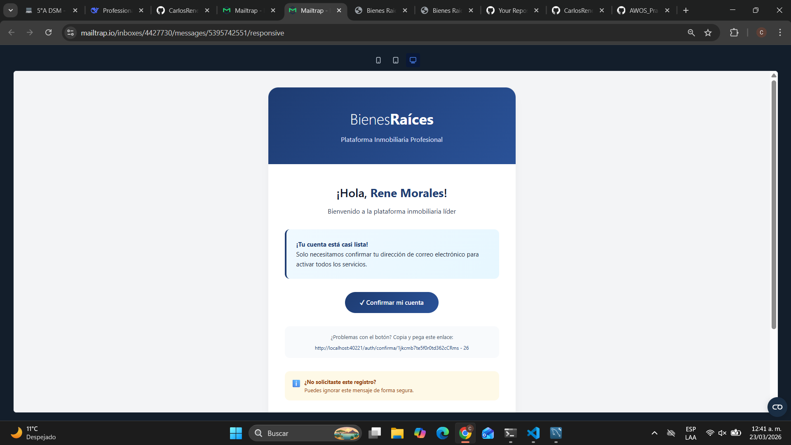

#### Validacion:
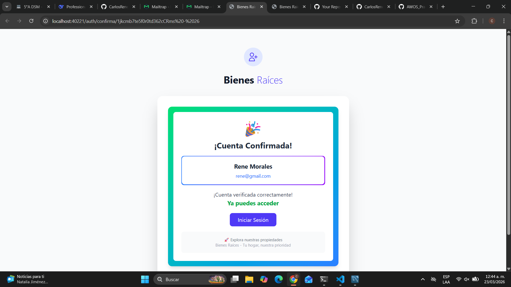

---

### - TEST 6: Actualización exitosa de contraseña de un usuario validado
##### Objetivo:
Comprobar que un usuario previamente validado pueda actualizar su contraseña mediante el flujo de recuperación.

##### Resultado esperado:
La contraseña se actualiza correctamente y el usuario puede iniciar sesión con la nueva credencial.

#### Actualización de contraseña:
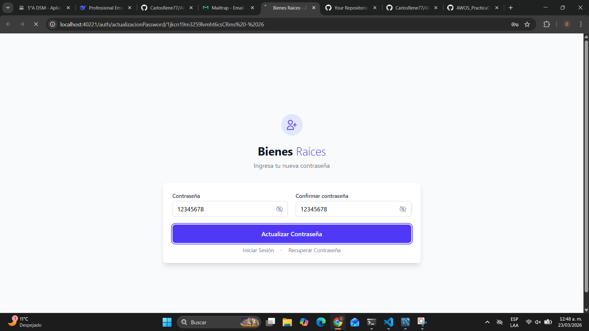
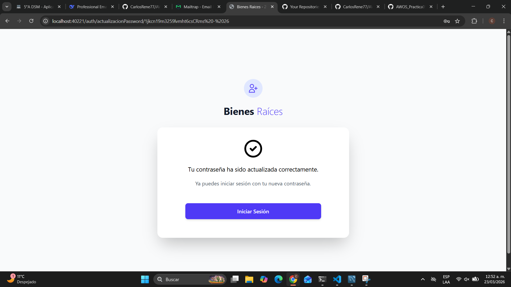

---

### - TEST 7: Actualización fallida de contraseña de un usuario no validado
##### Objetivo:
Validar que el sistema restrinja la actualización de contraseña a usuarios que no han validado su cuenta.

##### Resultado esperado:
El sistema bloquea la acción y muestra un mensaje indicando que el usuario debe validar su cuenta antes de continuar.

#### Usuario no valido:
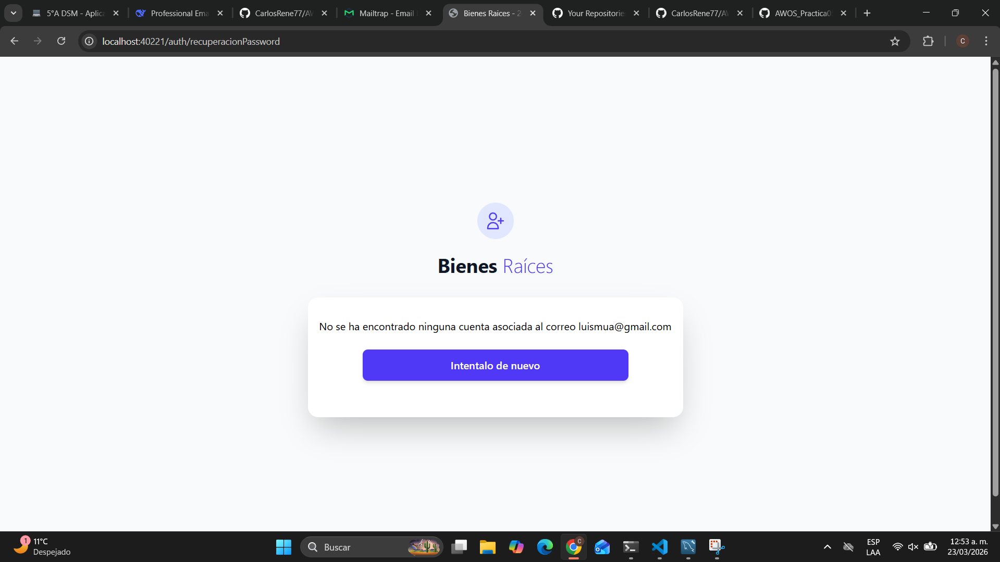

---

### - TEST 8: Actualización fallida de contraseña de un usuario por errores de formulario y token inválido.
##### Objetivo:
Verificar que el sistema detecte errores en el formulario y valide correctamente la vigencia del token de recuperación.

##### Resultado esperado:
El sistema muestra mensajes de error correspondientes y evita la actualización de la contraseña cuando el token es inválido o los datos son incorrectos.
#### Token Invalido:
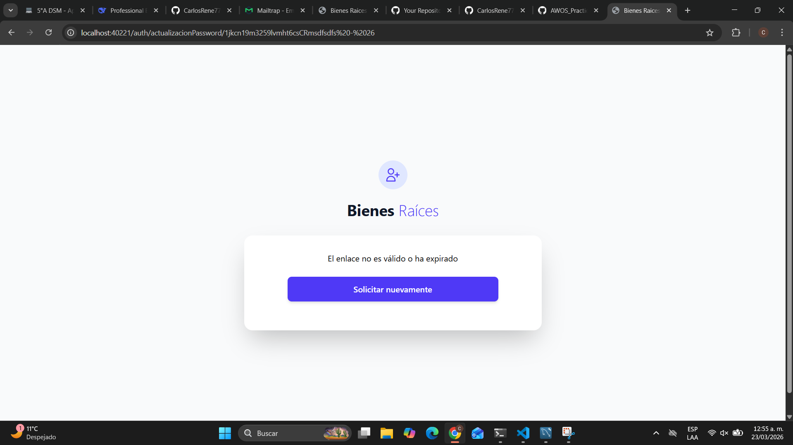

---

### - TEST 9: Logeo Exitoso del Usuario monstrar página de Mis Propiedades
##### Objetivo:
Confirmar que un usuario con credenciales válidas pueda iniciar sesión y sea redirigido a su panel principal.

##### Resultado esperado:
El usuario accede correctamente al sistema y se muestra la página de “Mis Propiedades” con su información.
#### Logueo Exitoso:
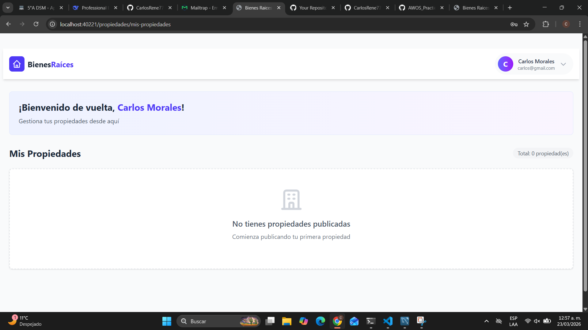

---

### - TEST 10: Bloqueo de cuenta por exceso de intentos fallidos (5 intentos)
##### Objetivo:
Validar que el sistema implemente un mecanismo de seguridad que bloquee la cuenta tras múltiples intentos fallidos de inicio de sesión.

##### Resultado esperado:
Después de 5 intentos fallidos, la cuenta es bloqueada correctamente, notificando al usuario mediante mensaje en pantalla y/o correo electrónico.
#### Bloqueo de cuenta:
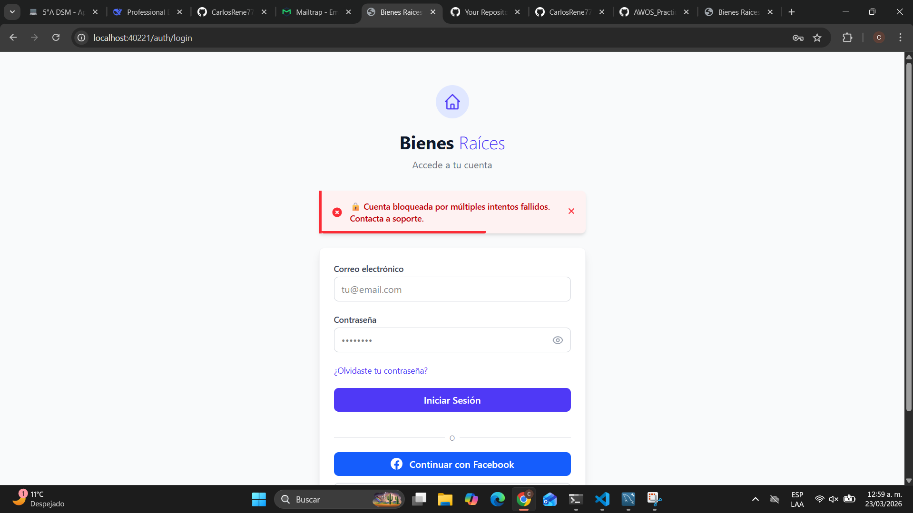

#### Correo de aviso de bloqueo de la cuenta
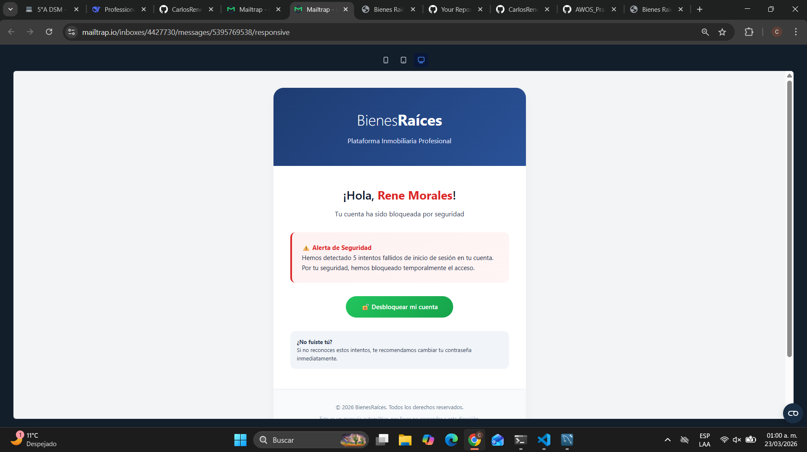
